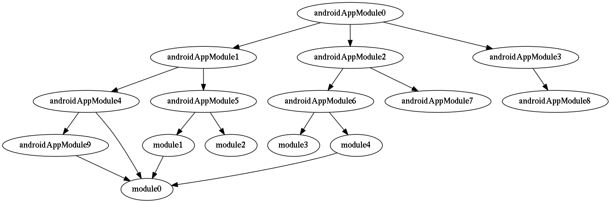
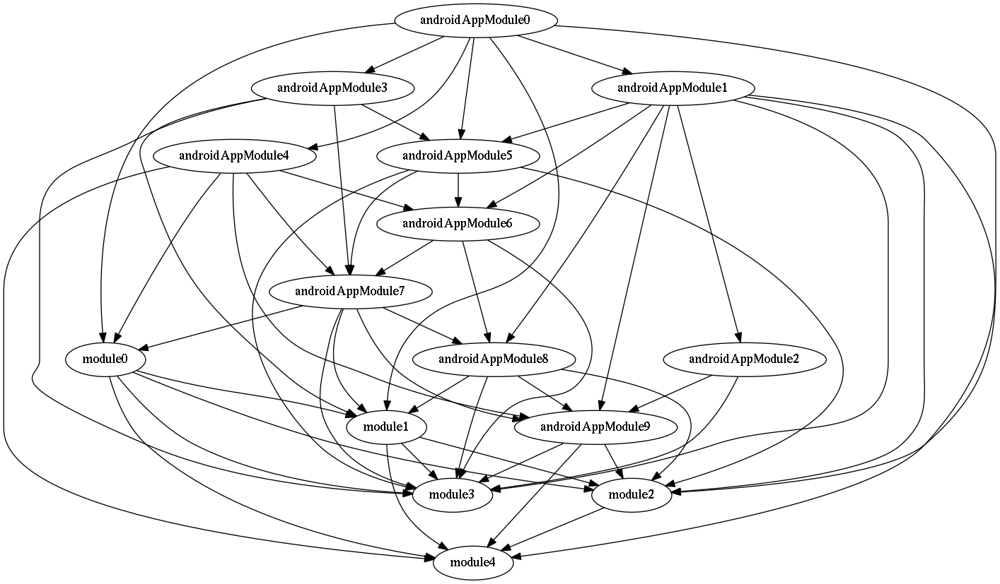
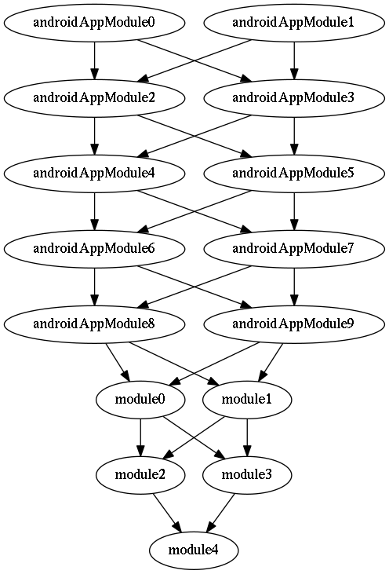
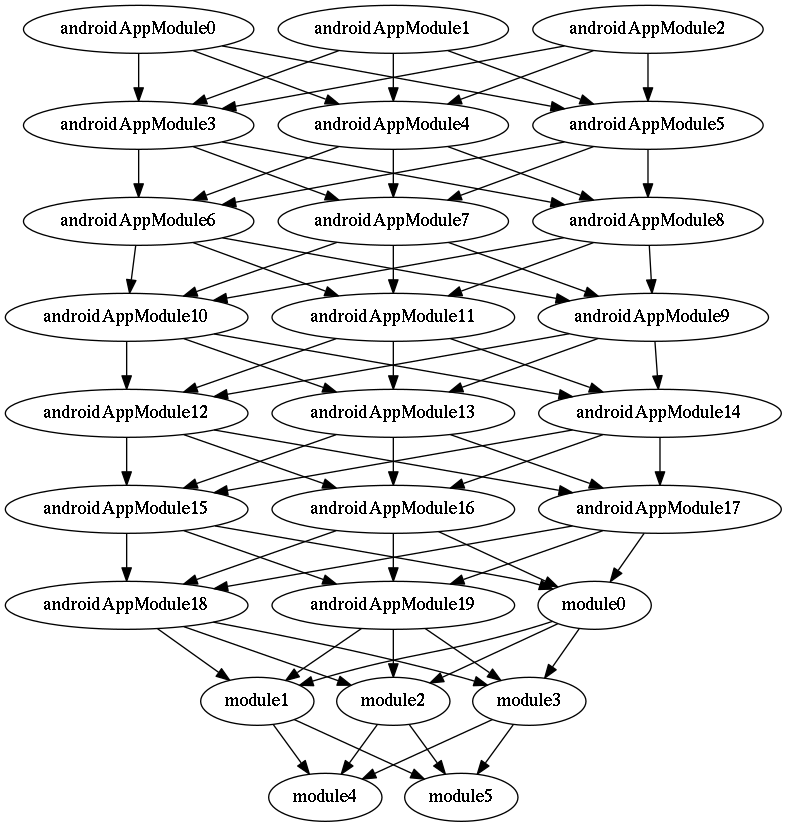

# android_projects

A selection of generated Android projects buildable with Gradle and Bazel,
inspired by
[https://github.com/sunyal/gradle-profiler](https://github.com/sunyal/gradle-profiler).
This project reuses some of the configuration and scripts in
[https://github.com/sunyal/gradle-profiler](https://github.com/sunyal/gradle-profiler)
as well.

These projects are used for A/B testing build optimizations with the build systems.

# Building and benchmarking

For all projects, in each subdirectory:

- `bazel build //androidAppModule0`
- `gradle assembleDebug`

To benchmark, run the project's `benchmark.sh` script to trigger builds with
Gradle and Bazel. The results are recorded as CSV and HTML in the project's
`output` folder.

# Project generation

The projects are generated using various topologies, listed
[here](https://github.com/android/android-studio-poet/commit/d7a97aa679438aedac7229b50f72d9526552b8b7).

You can generate more by running:

```
# Generate the project sources
$ java -jar third_party/android-studio-poet-all-1.0-SNAPSHOT-BAZEL-EXTENSIONS.jar example_config.json

# Prepare the benchmark scripts and generate the Bazel and Gradle dependency graph PNGs
$ ./prepare_project.sh $name_of_project 
```

where [example_config.json](example_config.json) contains your desired project setup.

Remember to refer to the dependency graphs when modifying the file paths in the
project's `performance.scenarios`. Every project has different Java/Android
modules for leaf and root nodes.

The `android-studio-poet` fork is here: https://github.com/jin/android-studio-poet

## Benchmarking

Go into the project subdirectory and run `./benchmark.sh`. This will trigger
Gradle and Bazel to run the scenarios defined in the project's
`performance.scenarios`.

# Projects

## [simple_tree](/simple_tree)

### Gradle graph


### Bazel graph


## [variable_tree](/variable_tree)

### Gradle graph



### Bazel graph


## [big_variable_tree](/big_variable_tree)

### Gradle graph


### Bazel graph


## [full](/full)

### Gradle graph


### Bazel graph


## [connected](/connected)

### Gradle graph



### Bazel graph


## [big_connected](/big_connected)

### Gradle graph


### Bazel graph


## [linear](/linear)

### Gradle graph


### Bazel graph


## [star](/star)

### Gradle graph


### Bazel graph


## [rectangle](/rectangle)

### Gradle graph



### Bazel graph


## [connected_rectangle](/connected_rectangle)

### Gradle graph



### Bazel graph


